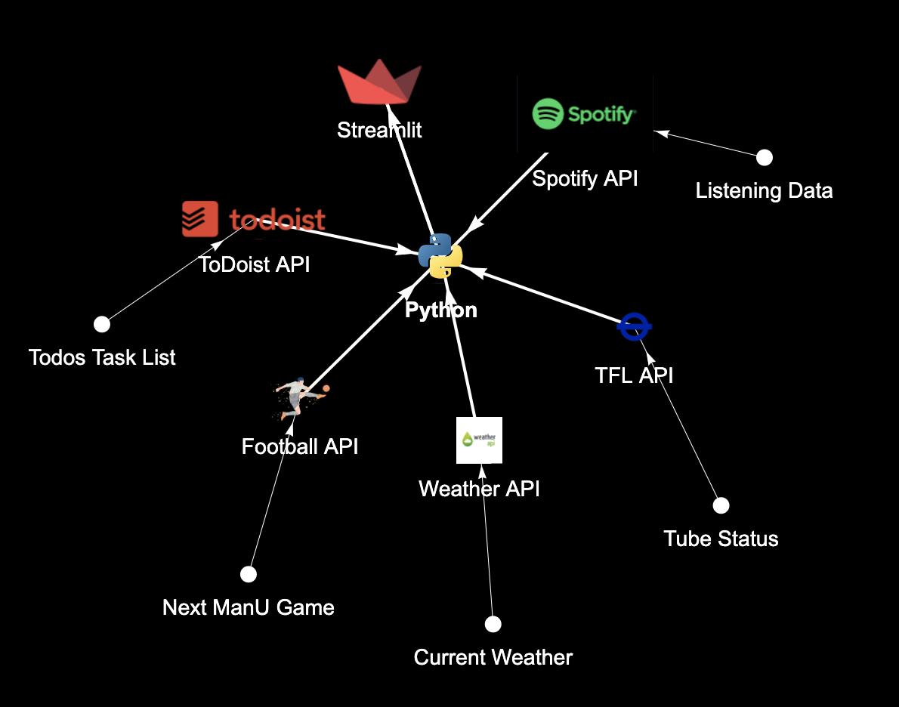
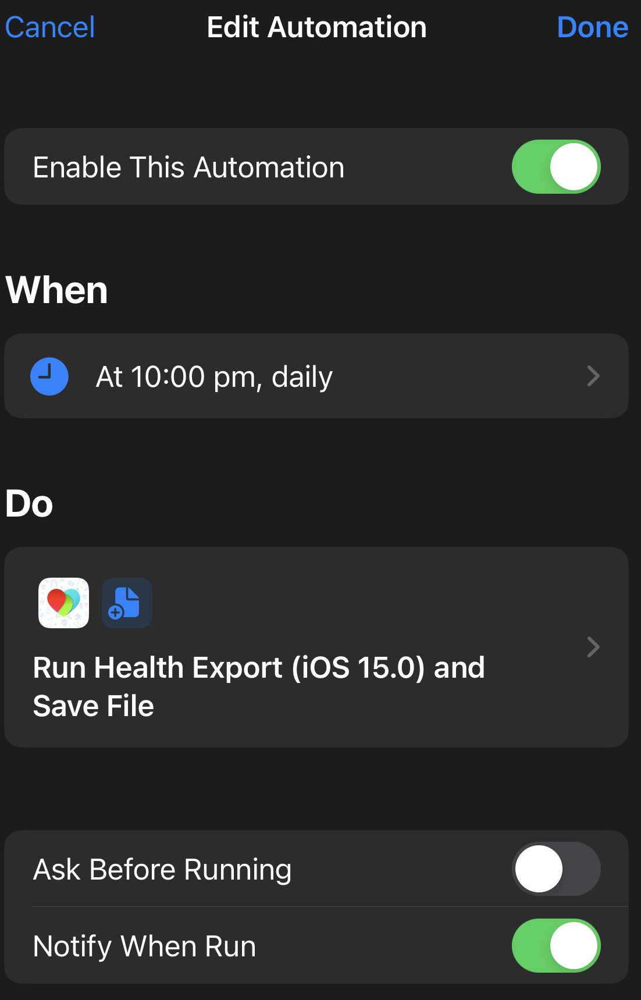
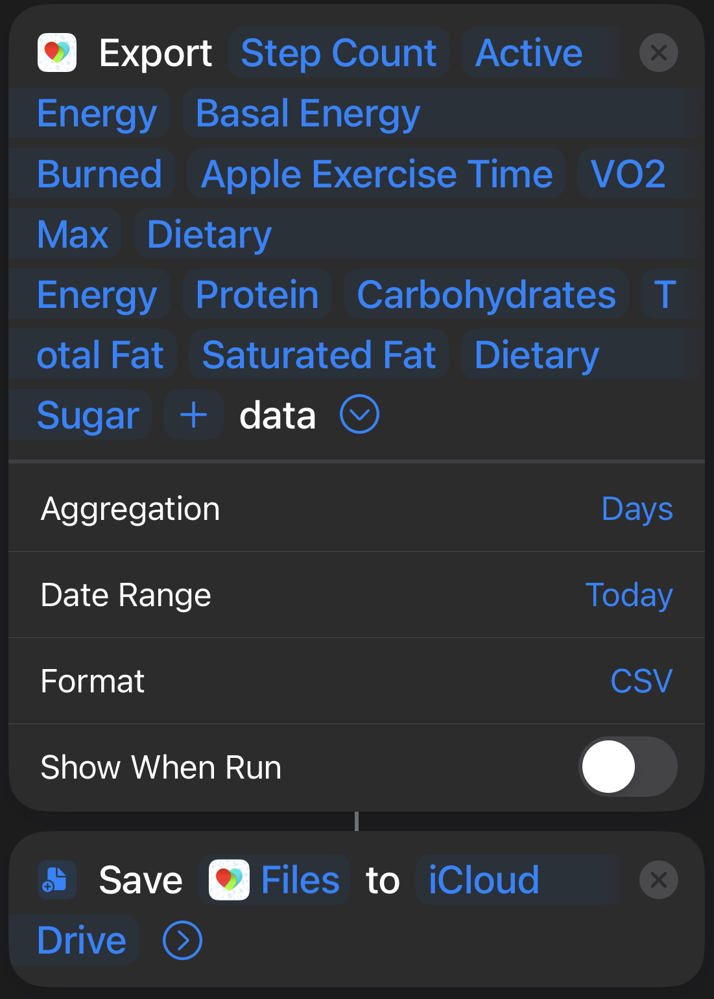
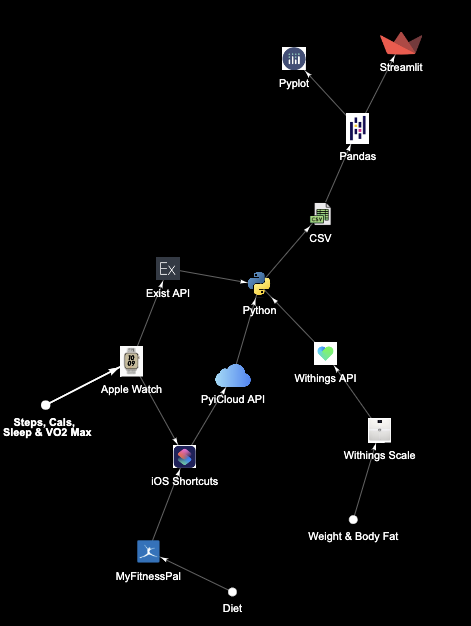
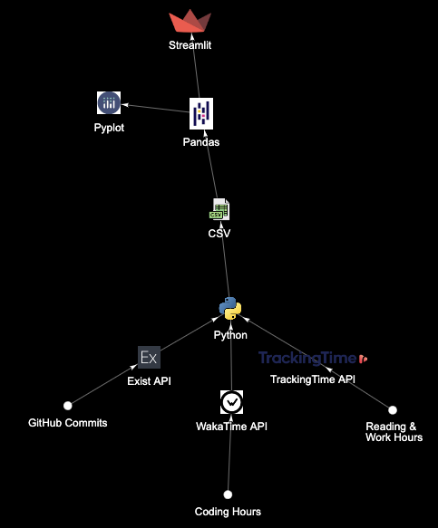

<h2 align="center">Interactive Dashboard</h2>

<h4 align="center">Languages and Technologies</h4>

	
	 
	
	
    
    
     

<h2 align="center">Introduction</h2>
As someone who loves collecting data on my daily life, I was motivated by the need to simplify the often cumbersome process of accessing and analyzing data that plays a crucial role in my daily life. Before creating this dashboard, I found myself frequently jumping between multiple apps and sources of information just to gather the data I needed to make informed decisions about my health, work, and other important aspects of my life.

Not only was this approach inefficient and time-consuming, but it also made it difficult to get a complete and holistic view of the data I was dealing with. It was a challenge to track trends over time, identify patterns, and draw meaningful insights from the information at my disposal. In short, the lack of a centralized, user-friendly platform for managing my personal data was hindering my ability to live a more organized, productive, and fulfilling life.

That's where this app comes in. By consolidating all of my personal data in one place and presenting it in a visually appealing and intuitive manner, this dashboard has made it much easier for me to monitor my progress, identify areas for improvement, and stay on top of the things that matter most to me; this app has become an indispensable tool for helping me stay organized, focused, and in control of my life.

I began by making a list of metrics I wanted to track in four core categories; general, health, personal and productivity. I dedicated a page to each of these categories in my dashboard

To view the dashboard (with dummy data for privacy), go to this [link](https://gabriella-martin-interactive-dashboard-welcome-9hpibj.streamlit.app/)

**Dashboarding Software**

Streamlit is a Python library that I chose to use for building my dashboard because of its simplicity, flexibility, and ease of use. I also chose to use Streamlit because I wanted to focus on improving my backend development skills while still being able to create a polished and user-friendly frontend for my dashboard. Streamlit provided an ideal solution to this challenge by enabling me to quickly build a professional-looking dashboard without requiring extensive knowledge of front-end development. This allowed me to focus more on the data processing and analysis that is critical to my project while still delivering a polished and responsive user experience. If you are a Python user, check it out [here]( https://docs.streamlit.io/)!

<h2 align="center">Welcome Data</h2>

*The full code for my welcome page pipeline can be viewed [here](https://github.com/gabriella-martin/Interactive-Dashboard/tree/main/RealTime_Pipelines), the code for the frontend can be viewed [here](https://github.com/gabriella-martin/Interactive-Dashboard/blob/main/Welcome.py)*

*All code on the home page is pulled once the page is loaded to ensure it is in accurate in real-time*

The homepage of my dashboard provides a snapshot of key information that I need to track on a daily basis. It includes the weather, upcoming football games, my to-do list, current tube status, and recently listened to music. The purpose of the homepage is to give me a quick and easy overview of the most important information I need to know at a glance. This enables me to plan my day efficiently and stay on top of my tasks and goals. 

**NASA Image of the Day**

NASA has multiple [API's](https://api.nasa.gov/), my favourite being the image of the day. As the name suggests, the API returns a mesmorizing space related picture each day. Here us one of my favourites

 

**Recent Music**

As part of my dashboard's welcome page, I have integrated Spotify's [API](https://developer.spotify.com/documentation/web-api/) to provide information on my music listening habits. The API seamlessly integrates with the welcome page, displaying the track that I am currently listening to. If I am not listening to anything at the moment, the API instead pulls information on the most recently played track. The ability to grab album artwork adds a visually appealing touch to the dashboard.

Spotify uses OAuth 2.0 and the steps to get the tokens needed are in the docs. The code for pulling currently listening to or just listened to is as follows:

**Current Weather**

I added a weather section to the welcome page of my dashboard to provide quick and easy access to the current weather conditions. This feature helps me to plan my day accordingly by giving me an idea of what to expect weather-wise. I retrieve the current temperature, current condition (which I format into an emoji), sunrise and sunset. There are many options for a free weather API but I use this [one](https://www.weatherapi.com/)

**Tube Status**

As I rely on the DLR for my daily commute, it is important for me to have up-to-date information on the current tube status to ensure that I can plan my journey efficiently. By retrieving this information via an API and formatting it with a corresponding emoji, my dashboard provides a quick and easy way for me to stay informed about any potential disruptions or delays that may affect my commute. TFL have a variety of [API's](https://api.tfl.gov.uk/), but for my purposes I only wish to retrieve the [line status](https://api.tfl.gov.uk/swagger/ui/index.html?url=/swagger/docs/v1#!/Line/Line_Get). Their REST API is very simple to use and below is the code for retrieving this data and formatting it with an emoji

**Todays Work Tasks**

In my personal dashboard, I rely on ToDoist to retrieve my work-related tasks for the day. Unlike the personal section, which shows the percentage of completed tasks, ToDoist's API is called each time the page loads to provide me with an up-to-date list of work-related tasks. By retrieving the content of each task, I get a clear overview of the specific work-related tasks that I need to complete, helping me stay organized and focused throughout the day. This is achieved by creating a unique project and retrieving the contents of this via their API.

**Next United Game**

As a lifelong fan of Manchester United, I never want to miss any of their games. To ensure that I am always up-to-date with the important information about the next match - including the date, time, whether it is a home or away game, the opponent, and the league - I use this football [API](https://rapidapi.com/api-sports/api/api-football/). This information is automatically retrieved and displayed as soon as the page is loaded, allowing me to stay on top of the latest fixtures

**Data Pipeline Visualisation**

---

*Rather than real-time data streaming, for this page and subsequent pages the pipeline is ran once nightly in a batch process*

<h2 align="center">Health Data</h2>

*The full code for my health data pipeline can be viewed [here](https://github.com/gabriella-martin/Interactive-Dashboard/blob/main/Batch_Pipelines/Health-Data-Pipeline.py), the code for the frontend can be viewed [here](https://github.com/gabriella-martin/Interactive-Dashboard/blob/main/pages/2%20_%F0%9F%A4%8D_Health.py)*

#### Pipeline One: Retrieving Steps, Active Calories, Total Calories Burned, Exercise, VO₂ Max & Diet

My apple watch tracks my movement and VO2 max but currently there is no easy direct access to automatically retrieve this data, so I figured a work-around. Starting with [this app](https://www.healthexportapp.com/) and an iOS Shortcut that runs once daily at night that aggregates and retrieves important data points and saves it to a CSV in my iCloud Drive I use [MyFitnessPal](https://www.myfitnesspal.com/) to track my diet. Although they have their own [API](https://myfitnesspalapi.com/), they are selective of who they give out API keys to, I have applied but have yet to receive a response. Nevertheless, Apple Health can connect to it for some basic metrics which is sufficient for my needs. I chose the most important diet metrics to me and included these in the daily data extraction. 

	
	 
 

Next step is to gain access to this file in my Python script, for this I use [PyiCloud]( https://github.com/picklepete/pyicloud). Once the file is accessible, I use python to extract and process the data. This data alongside the other health metrics is then added to my database CSV file ready to be visualised with Streamlit and Pandas

#### Pipeline Two: Retrieving Sleep

Although in theory the above process should work for sleep data, I found it buggy - 50% of the time the sleep data was empty. However, what I use for my mood-tracker, [Exist]( https://exist.io/), has integrations with Apple Health, so getting sleep from their [API]( https://developer.exist.io/) was much more successful. When my python script runs each night, I use their REST API to get my sleep time, which goes directly to my CSV ready for visualisation with Stremalit and Pandas

#### Pipeline Three: Retrieving Body Metrics

For retrieval of my body measurements, I use a [Withings Smart-Scale]( https://www.withings.com/uk/en/scales), coupled with their [API]( https://developer.withings.co.uk/). I do a daily weigh-in which my Python script retrieves daily via their API. The data is then added to my CSV database for visualisation with Streamlit and Pandas

**Data Pipeline Visualisation**

	
 

<h2 align="center">Productivity Data</h2>

*The full code for my productivity data pipeline can be viewed [here](https://github.com/gabriella-martin/Interactive-Dashboard/blob/main/Batch_Pipelines/Productivity-Data-Pipeline.py), the code for the frontend can be viewed [here](https://github.com/gabriella-martin/Interactive-Dashboard/blob/main/pages/3%20_%F0%9F%A4%8D_Productivity.py)*

#### Pipeline One: Retrieving Working & Reading Hours

For tracking my working and reading time I use [Tracking Time](https://trackingtime.co/), other viable options with API’s include [RescueTime](https://www.rescuetime.co.uk/) or [Toggl](https://toggl.co.uk/), but I prefer the interface of Tracking Time. Daily my Python script connects to their [API]( https://api.trackingtime.co/doc/index.html) and with a bit of processing, I can retrieve the time spent that day on reading and working respectively. This data is then added to my CSV and visualised with Streamlit and Pandas

#### Pipeline Two: Retrieving Coding Hours

For a clearer picture on my productivity I installed [WakaTime]( https://wakatime.co.uk/) into my IDE to get the hours spent actually coding (which is a subset of my time spent working). Daily my Python script speaks to their [API]( https://wakatime.co.uk/developers) and adds this data to my CSV database for visualisation with Streamlit and Pandas

#### Pipeline Three: Retrieving GitHub Contributions

GitHub do have their own [API]( https://docs.github.co.uk/en/graphql) capable of retrieving this data but as I only care about commits at this moment, the [Exist]( https://exist.io/) – GitHub integration suffices. As above, my Python script connects to their [API]( https://developer.exist.io/) each night, retrieves this data and adds it to my CSV database for visualisation with Streamlit and Pandas

**Data Pipeline Visualisation**

	
 

<h2 align="center">Personal Data</h2>

*The full code for my personal data pipeline can be viewed [here](https://github.com/gabriella-martin/Interactive-Dashboard/blob/main/Batch_Pipelines/Personal-Data-Pipeline.py), the code for the frontend can be viewed [here](https://github.com/gabriella-martin/Interactive-Dashboard/blob/main/pages/4%20_%F0%9F%A4%8D_Personal.py)*

#### Pipeline One: Retrieving ToDo's Done Data

I organise my daily life with [ToDoist]( https://todoist.com/), who have a great [API]( https://developer.todoist.com/guides/) where each night my Python script retrieves the percentage of tasks in each ToDoist section I have completed that day. I separate the task into sections by creating projects in ToDoist.  As the majority of my tasks are recurring, some manipulation with Python is necessary to accurately retrieve what has been completed today. These daily percentages are then added to my CSV database file for visualisation with Streamlit & Pandas 

#### Pipeline Three: Retrieving Book Data

I have been an avid user of [Goodreads]( https://www.goodreads.com/user/show/108711145-gabriella-martin) to track my reading progress but although they did have a solid API, they have discontinued it and are no longer issuing keys. However, I use [Airtable]( https://airtable.com/) to store much of my personal data and began to add my book tracking data. I then could used their [API]( https://airtable.com/developers/web/api/introduction) to get my most recently read and currently reading books. Rather than being added daily to a CSV, this is instead called whenever the page is loaded in order to get an automatic update

#### Pipeline Four: Retrieving Listening Data

I use the Spotify [API]( https://developer.spotify.com/documentation/web-api/). There are many options for data to pull about your listening habits and I use a couple throughout the dashboard. Here I pull my recent top tracks so I can see what I have had on repeat recently. This is also not added to the CSV database and is again pulled automatically when the page is loaded